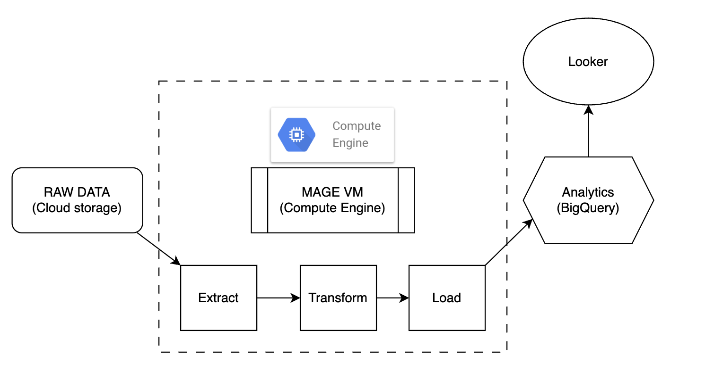
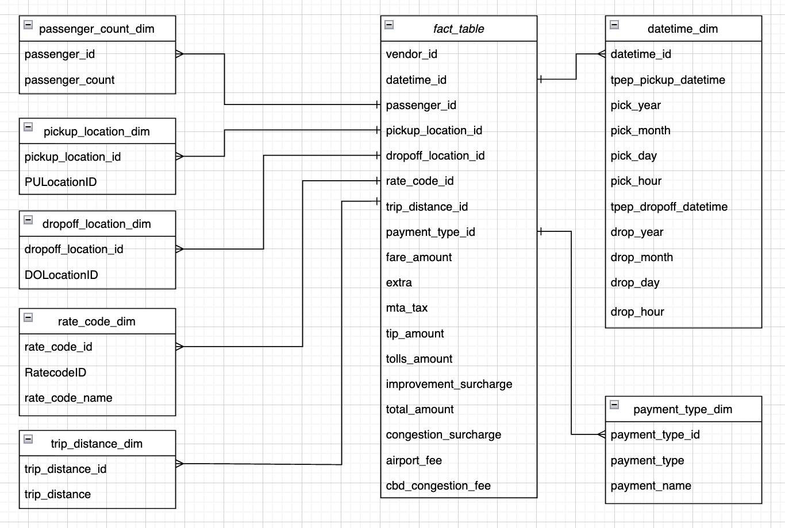

# TLC_Trip_Pipeline_on_GCP
A brief data pipeline built on the modern GCP platform, using a small subset of the TLC Trip Record Data.

## Introduction
The goal of this project is to perform data analytics on Uber data using various tools and technologies, including GCP Storage, Python, Compute Instance, Mage Data Pipeline Tool, BigQuery, and Looker Studio.

## Architecture 

## Technology Used
- Programming Language - Python

Google Cloud Platform
1. Google Storage
2. Compute Instance 
3. BigQuery
4. Looker Studio

Modern Data Pipeine Tool - https://www.mage.ai/

## Dataset Used
TLC Trip Record Data
Yellow and green taxi trip records include fields capturing pick-up and drop-off dates/times, pick-up and drop-off locations, trip distances, itemized fares, rate types, payment types, and driver-reported passenger counts. 

More info about dataset can be found here: https://www.nyc.gov/site/tlc/about/tlc-trip-record-data.page

## Data Model

## More Informations
The file commands_work_with_ssh.txt contain turtorial and note about how to work on SSH of VM and somethings we need to do when interact with GCP.

